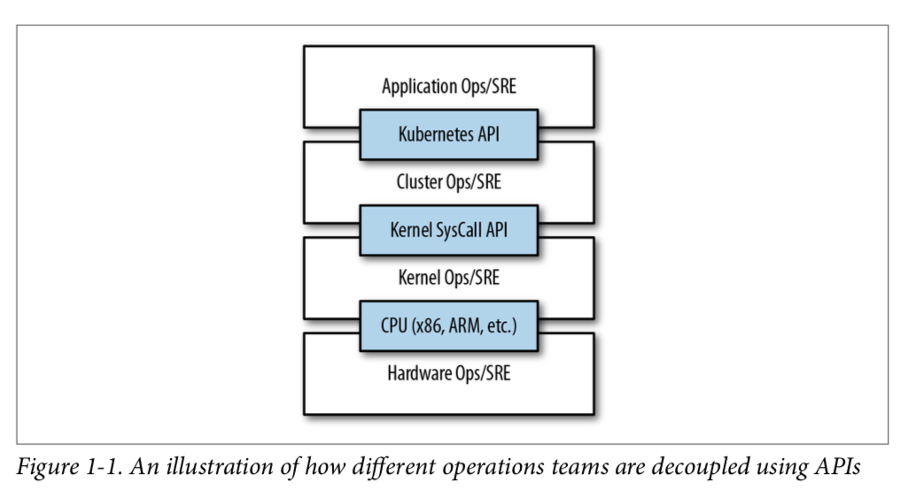

# Chapter 1 - Introduction
* Kubernetes is an open source orchestrator for deploying containerized applications.
* You may be wondering what we mean when we say "reliable, scalable distributed systems". More and more services are delivered over the network via APIs. These APIs are often delivered by a _distributed system_, the various pieces that implement the API running on different machines, connected via the network and coordinating their actions via network communication. Because we rely on these APIs increasingly for all apsects of our daily lives (e.g. finding directions to the nearest hospital), these systems must be highly _reliable_.
* Likewise, they must maintain _availability_ even during software rollouts or other maintenance events. Finally, because more and more of the world is coming online and using such services, they must be highly _scalable_ so that they can grow their capacity to keep up with ever-increasing usage without radical redesign of the distributed system that implements the services.
* Reasons why people use Kubernetes:
    * Velocity
    * Scaling (of both software and teams)
    * Abstracting your infrastructure
    * Efficiency
## Velocity
* The difference between you and your competitors is often the speed with which you can develop and deploy new components and features, or the speed with which you can respond to innovations developed by others.
* It is important to note, however, that velocity is not defined in terms of simply raw speed. While your users are always looking for iterative improvement, they are more interested in a highly reliable service.
* Velocity is measured not in terms of the raw number of features you can ship per hour or day, but rather in terms of the number of things you can ship while maintaining a highly avaiable service.
* The core concepts that enable this are:
    * Immutability
    * Declarative configuration
    * Online self-healing systems
## The Value of Immutability
* With immutable infrastructure, once an artifact is created in the system it does not change via user modifications.
* With mutable infrastructure, changes are applied as incremental updates to an existing system.
* A system upgrade via the `apt-get update` tool is a good example of an update to a mutable system.
* Furthermore, in any system run by a large team, it is highly likely that these changes will have been performed by many different people, and in many cases will not have been recorded anywhere.
* Furthermore, in any system run by a large team, it is highly likely that these changs will have been performed by many different people, and in many cases will not have been recorded anywhere.
* In contrast, in an immutable system, rather than a series of incremental updates and changes, an entirely new, complete image is build, where the update simply replaces the entire image with the newer image in a single operation.
* The key differentiation is the artifact that you create, and the record of how you created it.
* Additionally, building a new image rather than modifying an existing one means the old image is still around, and can quickly be used for a rollback if an error occurs.
## Declarative Configuration
* Everything in Kubernetes is a _declarative configuration object_ that represents the desired state of the system.
* While imperative commands define actions, declarative configurations define state.
* Since the effects of declarative configuration can be understood before they are executed, declarative configuration is far less error-prone.
* The idea of storing declarative configuration in source control is often referred to as "infrastructure as code".
## Self-Healing Systems
* Kubernetes is an online, self-healing system. When it receives a desired state configuration, it does not simply take a set of actions to make the current state match the desired state a single time. It _continuosly_ takes actions to ensure that the current state matches the desired state.
* If you manually create a fourth replica, Kubernetes will destroy one to bring the number back to three. If you manually destroy a replica, Kubernetes will create one to again return you to the desired state.
Online self-healing systems improve developer velocity because the time and energy might otherwise have spent on operations and maintenance can instead be spent on developing and testing new features.
## Scaling Your Service and Your Teams
### Decoupling
* In a decoupled architecture, each component is separated from other components by defined APIs and service load balancers.
### Easy Scaling for Application and Clusters
* Because your container are immutable, and the number of replicas is merely a number in a declarative config, scaling your service upward is simply a matter of changing a number in a configuration file, asserting this new declarative state to Kubernetes, and letting it take care of the rest.
* Of couse, that sort of scaling assumes that there are resources available in your cluster to consume.
* One of the challenges of scaling machine resources is predicting their use.
* If instaed you use Kubernetes to decouple the teams from the specific machines they are using, you can forecast growth based on the aggregate growth of all three services. Combining three variable growth rates into a single growth rate reduces statistical noise and procues a more reliable forecast to expected growth.
### Scaling Development Teams with Microservices
* As noted in a variety of research, the ideal team size is the "two-pizza team", or roughly six to eight people. Larger teams tend to suffer from issues of hierarchy, poor visibility, and infightining, which hinder agility and success.
* Kubernetes provides numerous abstractions and APIs that make it easier to build these decoupled microservice architectures:
    * _Pods_
    * _services_
    * _Namespaces_
    * _Ingress_
### Separation of Concerns for Consistency and Scaling
* The container orchestration API becomes a crisp contract that separates the responsibilities of the application operator from the cluster orchestration operator:
    * Application developer relies on service-level agreement (SLA) and cluster operator relies on delivering the SLA.

* The decision of whether to use KaaS or manage it yourself is one each user needs to make based on the skills and demands of their situation.
## Abstracting Your Infrastructure
* In many cases, the cloud comes with particular details in implementation or services that are specific to the cloud provider.
* The move to application-oriented container separates developers from specific machines.
* Kubernetes has a number of plug-ins that can abstract you from a particular cloud (load balancers, for example).
## Efficiency
* Their applications can be colocated on the same machines without impacting the application themselves. This means that tasks from multiple users can be packed tighly onto fewer machines.
* Efficiency can be measured by the ratio of the useful work performed by a machine or process to the total amout of energy spent doing so.