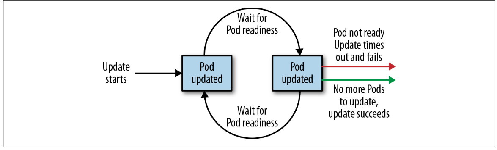

# Deployments

The Deployment object exists to manage the release of new versions. Deployments represent deployed applications in a way that transcends any particular version.
Additionally, deployments enable you to easily move from one version of your code to the next. This “rollout” process is specifiable and careful. It waits for a user configurable amount of time between upgrading individual Pods. It also uses health checks to ensure that the new version of the application is operating correctly, and
stops the deployment if too many failures occur.

The actual mechanics of the software rollout performed by a deployment is controlled by a deployment controller that runs in the Kubernetes cluster itself. This makes it easy to integrate deployments with numerous continuous delivery tools and services. Further, running server-side makes it safe to perform a rollout from places with poor or intermittent internet connectivity. Imagine rolling out a new version of your software from your phone while riding on the subway. Deployments make this possible and safe!

## Your First Deployment

A deployment can be represented as a declarative YAML object that provides the details about what you want to run. In the following case, the deployment is requesting a single instance of the kuard application
```yaml
apiVersion: extensions/v1beta1
kind: Deployment
metadata:
    name: kuard
spec:
    selector:
        matchLabels:
            run: kuard
    replicas: 1
    template:
        metadata:
            labels:
                run: kuard
        spec:
            containers:
            - name: kuard
                image: gcr.io/kuar-demo/kuard-amd64:blue 
```

```bash 
kubectl create -f kuard-deployment.yaml
```

## Deployment Internals

Deployments manage ReplicaSets. As with all relationships in Kubernetes, this relationship is defined by labels and a label selector. You can see the label selector by looking at the Deployment object.

```bash 
kubectl get deployments kuard -o yaml
```

From this you can see that the deployment is managing a ReplicaSet with the label run=kuard.

```bash 
kubectl get replicasets --selector=run=kuard
```

Now let’s see the relationship between a deployment and a ReplicaSet in action. We can resize the deployment using the imperative scale command

```bash 
kubectl scale deployments kuard --replicas=2
```

Kubernetes is an online, self-healing system. The top-level Deployment object is managing this ReplicaSet. If you ever want to manage that ReplicaSet directly, you need to delete the deployment (remember to set --cascade to false, or else it will delete the ReplicaSet and Pods as well!)

## Creating Deployments

As a starting point, download this deployment into a YAML file
    
```bash 
kubectl get deployments kuard -o yaml > kuard-deployment.yaml
```
```bash 
kubectl replace -f kuard-deployment.yaml --save-config
```

The deployment spec has a very similar structure to the ReplicaSet spec. There is a Pod template, which contains a number of containers that are created for each replica managed by the deployment. In addition to the Pod specification, there is also a strategy object

```yaml 
strategy:
    rollingUpdate:
    maxSurge: 1
    maxUnavailable: 1
    type: RollingUpdate
 ```

The strategy object dictates the different ways in which a rollout of new software can proceed. There are two different strategies supported by deployments: Recreate and RollingUpdate.

## Managing Deployments

As with all Kubernetes objects, you can get detailed information about your deployment via the kubectl describe command

```bash
kubectl describe deployments kuard
```

Two of the most important pieces of information in the output are OldReplicaSets and NewReplicaSet. These fields point to the ReplicaSet objects this deployment is currently managing. If a deployment is in the middle of a rollout, both fields will be set to a value. If a rollout is complete, OldReplicaSets will be set to <none>.

## Updating Deployments

Deployments are declarative objects that describe a deployed application. The two most common operations on a deployment are scaling and application updates.

### Scaling a Deployment

the best practice is to manage your deployments declaratively via the YAML files, and then use those files to update your deployment. To scale up a deployment, you would edit your YAML file to increase the number of replicas.

```yaml 
spec:
 replicas: 3
 ```

 ```bash 
 kubectl apply -f kuard-deployment.yaml
 ```

### Updating a Container Image

The other common use case for updating a deployment is to roll out a new version of the software running in one or more containers. To do this, you should likewise edit the deployment YAML file, though in this case you are updating the container image, rather than the number of replicas

```yaml
 containers:
    - image: gcr.io/kuar-demo/kuard-amd64:green
    imagePullPolicy: Always
 ```
 
We are also going to put an annotation in the template for the deployment to record some information about the update

```yaml
spec:
    ...
    template:
    metadata:
    annotations:
    kubernetes.io/change-cause: "Update to green kuard"
 ```

Again, you can use kubectl apply to update the deployment:

```bash 
 kubectl apply -f kuard-deployment.yaml
 ```

After you update the deployment it will trigger a rollout, which you can then monitor via the kubectl rollout command

```bash 
kubectl rollout status deployments kuard
deployment kuard successfully rolled out
```

You can see the old and new ReplicaSets managed by the deployment along with the images being used. Both the old and new ReplicaSets are kept around in case you want to roll back

```bash
kubectl get replicasets -o wide
```

If you are in the middle of a rollout and you want to temporarily pause it for some reason, you can use the pause command

```bash
kubectl rollout pause deployments kuard
deployment "kuard" paused
```

If, after investigation, you believe the rollout can safely proceed, you can use the resume command to start up where you left off

```bash 
kubectl rollout resume deployments kuard
deployment "kuard" resumed
```

### Rollout History

You can see the deployment history by running

```bash
kubectl rollout history deployment kuard
```

```bash 
kubectl rollout history deployment kuard --revision=2
```

Update the kuard version back to blue by modifying the container version number and updating the change-cause annotation. Apply it with kubectl apply

```bash
ubectl rollout history deployment kuard
```

Let’s say there is an issue with the latest release and you want to roll back while you investigate. You can simply undo the last rollout

```bash
kubectl rollout undo deployments kuard
deployment "kuard" rolled back
```

```bash 
kubectl rollout history deployment kuard
```

if you want a specific version 

```bash 
kubectl rollout undo deployments kuard --to-revision=1
``` 

By default, the complete revision history of a deployment is kept attached to the Deployment object itself. Over time (e.g., years) this history can grow fairly large, so it is recommended that if you have deployments that you expect to keep around for a long time you set a maximum history size for the deployment revision history, to limit the total size of the Deployment object.

To accomplish this, use the revisionHistoryLimit property in the deployment specification

```yaml
spec:
 # We do daily rollouts, limit the revision history to two weeks of
 # releases as we don't expect to roll back beyond that.
 revisionHistoryLimit: 14
 ```

## Deployment Strategies

### Recreate Strategy

It simply updates the ReplicaSet it manages to use the new image and terminates all of the Pods associated with the deployment. The ReplicaSet notices that it no longer has any replicas, and re-creates all Pods using the new image. Once the Pods are re-created, they are running the new version.

While this strategy is fast and simple, it has one major drawback—it is potentially catastrophic, and will almost certainly result in some site downtime.

### RollingUpdate Strategy

Using RollingUpdate, you can roll out a new version of your service while it is still receiving user traffic, without any downtime. The RollingUpdate strategy works by updating a few Pods at a time, moving incrementally until all of the Pods are running the new version of your software.

### Managing multiple versions of your service

Importantly, this means that for a period of time, both the new and the old version of your service will be receiving requests and serving traffic.

### Configuring a rolling update

The maxUnavailable parameter sets the maximum number of Pods that can be unavailable during a rolling update. It can either be set to an absolute number (e.g., 3, meaning a maximum of three Pods can be unavailable) or to a percentage (e.g., 20%, meaning a maximum of 20% of the desired number of replicas can be unavailable).

At its core, the maxUnavailable parameter helps tune how quickly a rolling update proceeds. For example, if you set maxUnavailable to 50%, then the rolling update will immediately scale the old ReplicaSet down to 50% of its original size. If you have four replicas, it will scale it down to two replicas. The rolling update will then replace the removed Pods by scaling the new ReplicaSet up to two replicas, for a total of four rep‐ licas (two old, two new). It will then scale the old ReplicaSet down to zero replicas, for a total size of two new replicas. Finally, it will scale the new ReplicaSet up to four rep‐ licas, completing the rollout. Thus, with maxUnavailable set to 50%, our rollout com‐ pletes in four steps, but with only 50% of our service capacity at times.

However, there are situations where you don’t want to fall below 100% capacity, but you are willing to temporarily use additional resources in order to perform a rollout. In these situations, you can set the maxUnavailable parameter to 0%, and instead con‐ trol the rollout using the maxSurge parameter. Like maxUnavailable, maxSurge can be specified either as a specific number or a percentage

The maxSurge parameter controls how many extra resources can be created to ach‐ ieve a rollout. To illustrate how this works, imagine we have a service with 10 replicas. We set maxUnavailable to 0 and maxSurge to 20%. The first thing the rollout will do is scale the new ReplicaSet up to 2 replicas, for a total of 12 (120%) in the service. It will then scale the old ReplicaSet down to 8 replicas, for a total of 10 (8 old, 2 new) in the service. This process proceeds until the rollout is complete. At any time, the capacity of the service is guaranteed to be at least 100% and the maximum extra resources used for the rollout are limited to an additional 20% of all resources

### Slowing Rollouts to Ensure Service Health

The purpose of a staged rollout is to ensure that the rollout results in a healthy, stable service running the new software version. To do this, the deployment controller always waits until a Pod reports that it is ready before moving on to updating the next Pod.

Sometimes, however, simply noticing that a Pod has become ready doesn’t give you sufficient confidence that the Pod actually is behaving correctly. Some error condi‐ tions only occur after a period of time.

For deployments, this time to wait is defined by the minReadySeconds parameter

```yaml 
spec:
      minReadySeconds: 60
```

In addition to waiting a period of time for a Pod to become healthy, you also want to set a timeout that limits how long the system will wait. Suppose, for example, the new version of your service has a bug and immediately deadlocks. It will never become ready, and in the absence of a timeout, the deployment controller will stall your roll- out forever.

The correct behavior in such a situation is to time out the rollout. This in turn marks the rollout as failed. This failure status can be used to trigger alerting that can indicate to an operator that there is a problem with the rollout.

To set the timeout period, the deployment parameter progressDeadlineSeconds is used

```yaml 
spec:
      progressDeadlineSeconds: 600
```

It is important to note that this timeout is given in terms of deployment progress, not the overall length of a deployment. In this context, progress is defined as any time the deployment creates or deletes a Pod. When that happens, the timeout clock is reset to zero.



## Deleting a Deployment

```bash 
kubectl delete deployments kuard
```

In either case, by default, deleting a deployment deletes the entire service. It will delete not just the deployment, but also any ReplicaSets being managed by the deployment, as well as any Pods being managed by the ReplicaSets. As with Replica‐ Sets, if this is not the desired behavior, you can use the --cascade=false flag to exclusively delete the Deployment object.
