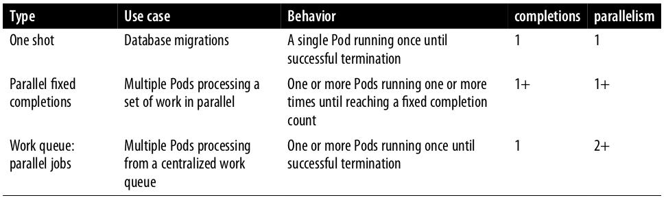

# Jobs

So far we have focused on long-running processes such as databases and web applications. These types of workloads run until either they are upgraded or the service is no longer needed. While long-running processes make up the large majority of workloads that run on a Kubernetes cluster, there is often a need to run short-lived, one-off tasks. The Job object is made for handling these types of tasks.

A job creates Pods that run until successful termination (i.e., exit with 0). In contrast, a regular Pod will continually restart regardless of its exit code. Jobs are useful for things you only want to do once, such as database migrations or batch jobs. If run as a regular Pod, your database migration task would run in a loop, continually repopulating the database after every exit.

## The Job Object

The Job object is responsible for creating and managing Pods defined in a template in the job specification. These Pods generally run until successful completion. The Job object coordinates running a number of Pods in parallel.

If the Pod fails before a successful termination, the job controller will create a new Pod based on the Pod template in the job specification. Given that Pods have to be scheduled, there is a chance that your job will not execute if the required resources are not found by the scheduler. Also, due to the nature of distributed systems there is a small chance, during certain failure scenarios, that duplicate Pods will be created for a specific task.

## Job Patterns

Jobs are designed to manage batch-like workloads where work items are processed by one or more Pods. By default, each job runs a single Pod once until successful termination. This job pattern is defined by two primary attributes of a job, namely the number of job completions and the number of Pods to run in parallel. In the case of the “run once until completion” pattern, the completions and parallelism parameters are set to 1.



### One Shot

One-shot jobs provide a way to run a single Pod once until successful termination. While this may sound like an easy task, there is some work involved in pulling this off. First, a Pod must be created and submitted to the Kubernetes API. This is done using a Pod template defined in the job configuration. Once a job is up and running, the Pod backing the job must be monitored for successful termination. A job can fail for any number of reasons, including an application error, an uncaught exception during runtime, or a node failure before the job has a chance to complete. In all cases, the job controller is responsible for recreating the Pod until a successful termination occurs.

```bash
kubectl run -i oneshot \
    --image=gcr.io/kuar-demo/kuard-amd64:1 \
    --restart=OnFailure \
    -- --keygen-enable \
       --keygen-exit-on-complete \
       --keygen-num-to-gen 10
```

After the job has completed, the Job object and related Pod are still around. This is so that you can inspect the log output. Note that this job won’t show up in `kubectl get jobs` unless you pass the `-a` flag. Without this flag, kubectl hides completed jobs. Delete the job before continuing:

```bash
kubectl delete jobs oneshot
```

The other option for creating a one-shot job is using a configuration file, as shown in `job-oneshot.yaml`. Submit the job using the kubectl apply command:

```bash
kubectl apply -f job-oneshot.yaml
```

Then describe the oneshot job:

```bash
kubectl describe jobs oneshot
```

You can view the results of the job by looking at the logs of the Pod that was created:

```bash
kubectl logs oneshot-
```

#### Pod failure

We just saw how a job can complete successfully. But what happens if something fails? Let’s try that out and see what happens. Let’s modify the arguments to kuard in our configuration file to cause it to fail out with a nonzero exit code after generating three keys, as shown in `job-oneshot-failure1.yaml`.

Now launch this with `kubectl apply -f jobs-oneshot-failure1.yaml`. Let it run for a bit and then look at the Pod status:

```bash
kubectl get pod -l job-name=oneshot
```

Kill the job `kubectl delete jobs oneshot`, and let’s try something else. Modify the config file again and change the restartPolicy from OnFailure to Never. Launch this with `kubectl apply -f jobs-oneshot-failure2.yaml`. If we let this run for a bit and then look at related Pods we’ll find something interesting:

```bash
kubectl get pod -l job-name=oneshot
```

What we see is that we have multiple Pods here that have errored out. By setting `restartPolicy: Never` we are telling the kubelet not to restart the Pod on failure, but rather just declare the Pod as failed. The Job object then notices and creates a replacement Pod. If you aren’t careful, this’ll create a lot of “junk” in your cluster. For this reason, we suggest you use `restartPolicy: OnFailure` so failed Pods are rerun in place.

### Parallelism

Generating keys can be slow. Let’s start a bunch of workers together to make key generation faster. We’re going to use a combination of the completions and parallelism parameters. Our goal is to generate 100 keys by having 10 runs of kuard with each run generating 10 keys. But we don’t want to swamp our cluster, so we’ll limit ourselves to only five Pods at a time.
This translates to setting completions to 10 and parallelism to 5. The config is shown in `job-parallel.yaml`.

Start it up:

```bash
kubectl apply -f job-parallel.yaml
```

Now watch as the Pods come up, do their thing, and exit. New Pods are created until 10 have completed altogether. Here we use the --watch flag to have kubectl stay around and list changes as they happen:

```bash
kubectl get pods -w
```

Feel free to study the completed jobs and check out their logs to see the fingerprints of the keys they generated. Clean up by deleting the finished Job object with `kubectl delete job parallel`.

### Work Queues

A common use case for jobs is to process work from a work queue. In this scenario, some task creates a number of work items and publishes them to a work queue. A worker job can be run to process each work item until the work queue is empty.


#### Starting a work queue

We start by launching a centralized work queue service. kuard has a simple memorybased work queue system built in. We will start an instance of kuard to act as a coordinator for all the work to be done.

Next, we create a simple ReplicaSet to manage a singleton work queue daemon. We are using a ReplicaSet to ensure that a new Pod will get created in the face of machine failure, as shown in `rs-queue.yaml`.

Run the work queue with the following command:

```bash
kubectl apply -f rs-queue.yaml
```

At this point the work queue daemon should be up and running. Let’s use port forwarding to connect to it. Leave this command running in a terminal window:

```bash
QUEUE_POD=$(kubectl get pods -l app=work-queue,component=queue -o jsonpath='{.items[0].metadata.name}')
```

```bash
kubectl port-forward $QUEUE_POD 8080:8080
```

You can open your browser to http://localhost:8080 and see the kuard interface. Switch to the “MemQ Server” tab to keep an eye on what is going on.

With the work queue server in place, we should expose it using a service. This will make it easy for producers and consumers to locate the work queue via DNS, as `service-queue.yaml` shows.

Create the queue service with kubectl:

```bash
kubectl apply -f service-queue.yaml
```

#### Loading up the queue

We are now ready to put a bunch of work items in the queue. For the sake of simplicity we’ll just use curl to drive the API for the work queue server and insert a bunch of work items. curl will communicate to the work queue through the kubectl port-forward we set up earlier, as shown in `load-queue.sh`.

Run these commands, and you should see 100 JSON objects output to your terminal with a unique message identifier for each work item. You can confirm the status of the queue by looking at the “MemQ Server” tab in the UI, or you can ask the work queue API directly:

```bash
curl 127.0.0.1:8080/memq/server/stats | jq
```

Now we are ready to kick off a job to consume the work queue until it’s empty.

#### Creating the consumer job

This is where things get interesting! kuard is also able to act in consumer mode. We can set it up to draw work items from the work queue, create a key, and then exit once the queue is empty, as shown in `job-consumers.yaml`.

Here, we are telling the job to start up five Pods in parallel. As the completions parameter is unset, we put the job into a worker pool mode. Once the first Pod exits with a zero exit code, the job will start winding down and will not start any new Pods. This means that none of the workers should exit until the work is done and they are all in the process of finishing up.

Now, create the consumers job:

```bash
kubectl apply -f job-consumers.yaml
```

Note there are five Pods running in parallel. These Pods will continue to run until the work queue is empty. You can watch as it happens in the UI on the work queue server. As the queue empties, the consumer Pods will exit cleanly and the consumers job will be considered complete.

#### Cleaning up

Using labels, we can clean up all of the stuff we created in this section:

```bash
kubectl delete rs,svc,job -l chapter=jobs
```

## CronJobs

Sometimes you want to schedule a job to be run at a certain interval. To achieve this you can declare a CronJob in Kubernetes, which is responsible for creating a new Job object at a particular interval. The declaration of a CronJob looks like in `cronjob.yaml`.

Note the spec.schedule field, which contains the interval for the CronJob in standard cron format.

You can save this file as cron-job.yaml, and create the CronJob with `kubectl create -f cron-job.yaml`. If you are interested in the current state of a CronJob, you can use `kubectl describe <cron-job>` to get the details.

