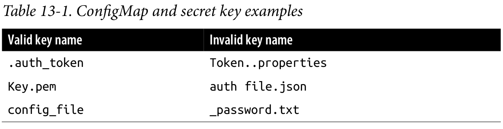

# ConfigMaps and Secrets

It is a good practice to make container images as reusable as possible.  The same image should be able to be used for development, staging, and production. It is even better if the same image is general-purpose enough to be used across applications and services. Testing and versioning get riskier and more complicated if images need to be recreated for each new environment. But then how do we specialize the use of that image at runtime?

This is where ConfigMaps and secrets come into play. ConfigMaps are used to pro‐ vide configuration information for workloads. This can either be fine-grained information (a short string) or a composite value in the form of a file. Secrets are similar to ConfigMaps but focused on making sensitive information available to the workload. They can be used for things like credentials or TLS certificates.

## ConfigMaps
One way to think of a ConfigMap is as a Kubernetes object that defines a small filesystem. Another way is as a set of variables that can be used when defining the environment or command line for your containers. The key thing is that the ConfigMap is combined with the Pod right before it is run.

### Creating ConfigMaps
You can create these in a immediate, imperative way, or you can create then from a manifest on disk.

```bash
kubectl create configmap my-config --from-file=examples/my-config.txt --from-literal=extra-param=extra-value --from-literal=another-param=another-value
```

The equivalent YAML for the ConfigMap object we just created can be found in [my-config.yml](examples/my-config.yaml)

The ConfigMap is really just some key/value pairs stored in an object.

### Using a ConfigMap

There are three main ways to use a ConfigMap:

- _Filesystem_: you c an mount a ConfigMap into a Pod. A file is created for each entry based on the key name. The contents of that file are set to the value.

- _Environment variable_: a ConfigMap can be used to dynamically set the value of a environment variable.

- _Command-line argument_: Kubernetes support dynamically creating the command line for a container based on ConfigMap values.

The manifest [kuard-config.yml](examples/13-2-kuard-config.yaml) for _kuard_ uses all of these together.

For the filesystem method, we create a new volume in the Pod named _config-volume_. We the define this volume to be a ConfigMap and point at the ConfigMap to mount. We have to specify where this gets mounted into the container with a _volumeMount_ (in this case `/config`).

Environment variables are specified with a special _valueFrom_ member. This references the ConfigMap and the data key to use within that ConfigMap.

Command-line arguments build on environment variables. Kubernets will perform the correct substitution with a special `$(<env-var-name>)` syntax.

To run this Pod:

```bash
kubectl apply -f examples/13-2-kuard-config.yml
kubectl port-forward kuard-config 8080
```

Opening the browser in the [forwarded address](http://localhost:8080) we can see that we’ve added two environment variables (`ANOTHER_PARAM` and `EXTRA_PARAM`) whose values are set via the ConfigMap. Furthermore, we’ve added an argument to the command line of _kuard_ based on the `EXTRA_PARAM` value.

Next, click the “File system browser” tab. This lets you explore the filesystem as the application sees it. You should see an entry called `/config`. This is a volume created based on our ConfigMap. If you navigate into that, you’ll see that a file has been created for each entry of the ConfigMap. You’ll also see some hidden files (prepended with `..`) that are used to do a clean swap of new values when the ConfigMap is updated.

## Secrets

While ConfigMaps are great for most configuration data, there is certain data that is extra-sensitive. This can include passwords, security tokens, or other types of private keys. Collectively, we call this type of data “secrets.” Kubernetes has native support for storing and handling this data with care.

Secrets enable container images to be created without bundling sensitive data.

### Creating Secrets

Secrets are created using the Kubernetes API or the `kubectl` command-line tool. Secrets hold one or more data elements as a collection of key/value pairs.

We can create a secret to store a TLS key and certificate for the kuard app. First, we have to obtain the key and certificate:

```bash
curl -o kuard.crt https://storage.googleapis.com/kuar-demo/kuard.crt
curl -o kuard.key https://storage.googleapis.com/kuar-demo/kuard.key
```

Now we create a secret named _kuard-tls_ using the `create secret` command:

```bash
kubectl create secret generic kuard-tls --from-file=kuard.crt --from-file=kuard.key
```

We can check the manifest with the `describe secrets` command:

```bash
kubectl describe secrets kuard-tls
```

Now we can consume it from Pod.

### Consuming Secrets
Secrets can be consumed using the Kubernetes REST API by applications that know how to call that API directly. However, our goal is to keep applications portable. Not only should they run well in Kubernetes, but they should run, unmodified, on other platforms.

Intead of accessing secrets through the API server, we can use a _secrets volume_.

#### Secrets Volumes
Secret data can be exposed to Oids using the secrets volume type. Secrets volumes are managed by the `kubelet` and are created at Pod creation time. Secrets are stored on tmpfs volumes (aka RAM disks), and as such are not written to disk on nodes.

Each data element of a secret is stored in a separate file under the target mount point specified in the volume mount. The `kuard-tls` secret contains two data elements: _kuard.crt_ and _kuard.key_. Mounting the `kuard-tls` secrets volume to `/tls` results in the following files:

- _/tls/kuard.crt_
- _/tls/kuard.key_

The Pod manifest in [kuard-secret.yaml](examples/13-3-kuard-secret.yaml) demonstrates how to declare a secrets volume, which exposes `kuard-tls` secret to the `kuard` container under `/tls`.

By running: 

```bash
kubectl apply -f kuard-secret.yml
kubectl port-forward kuard-tls 8443:8443
```

You can see now in the [web browser](https://localhost:8443) the kuard server is hosted via HTTPS.

### Private Docker Registries

A special use case for secrets is to store access credentials for private Docker registries. Kubernetes supports using images stored on private registries, but access to those images requires credentials. Private images can be stored accross one or more private registries.

_Image pull secrets_ leverage the secrets API to automate the distribution of private registry credentials. Image pull secrets are stored just like normal secrets but are consumed through the _spec.imagePullSecrets_ Pod specification field.

```bash
kubectl create secret docker-registry my-image-pull-secret --docker-username=<username> --docker-password=<password> --docker-email=<email-address>
```

The Pod manifest [kuard-secret-ips,yml](examples/13-4-kuard-secret-ips.yaml) access the private repo.


### Naming Constraints
The key names for data items inside of a secret or ConfigMap are defined to map to valid environment variable names. They may begin with a dot followed by a letter or number. Following characters include dots, dashes, and underscores. Dots cannot be repeated and dots and underscores or dashes cannot be adjacent to each other. More formally, this means that they must conform to the regular expression `^[.[?[a-zAZ0-9[([.[?[a-zA-Z0-9[+[-_a-zA-Z0-9[?)*$`.

Some examples can be found in the following table:



## Managing ConfigMaps and Secrets

Secrets and ConfigMaps are managed through the Kubernetes API. The usual `create`, `delete`, `get` and `describe` commands work for manipulating these objects.

### Listing

```bash
kubectl get secrets
kubectl get configmaps
```

Using `describe` will get you more details on a single object:

```bash
kubectl describe configmap my-config
```

And finally, you can see the raw data (including values in secrets!) with something like:

```bash
kubectl get configmap my-config -o yaml
kubectl get secret kuard-tls -o yaml
```

### Creating

The easiest way to create a secret or a ConfigMap is via `kubectl create secret` or `kubectl create configmap`. The following arguments let you specify which data items go into the secret or ConfigMap:

- `--from-file=<filename>`
Load from the file with the secret data key the same as the filename.

- `--from-file=<key>=<filename>`
Load from the file with the secret data key explicitly specified.

- `--from-file=<directory>`
Load all the files in the specified directory where the filename is an acceptable key name.

- `--from-literal=<key>=<value>`
Use the specified key/value pair directly.

### Updating
You can update a ConfigMap or secret and have it reflected in running programs. There is no need to restart if the application is configured to reread configuration values. This is a rare feature but might be something you put in your own applications.

#### Update from file
If you have a manifest for your ConfigMap or secret, you can just edit it directly and push a new version with `kubectl replace -f <filename>`. You can also use `kubectl apply -f <filename>` if you previously created the resource with `kubectl apply`.

Due to the way that data files are encoded into these objects, updating a configuration can be a bit cumbersome as there is no provision in kubectl to load data from an external file. The data must be stored directly in the YAML manifest.

The most common use case is when the ConfigMap is defined as part of a directory or list of resources and everything is created and updated together. Oftentimes these manifests will be checked into source control.

#### Recreate and update
If you store the inputs into your ConfigMaps or secrets as separate files on disk (as opposed to embedded into YAML directly), you can use kubectl to recreate the manifest and then use it to update the object.

This will look something like this:

```bash
kubectl create secret generic kuard-tls --from-file=kuard.crt --from-file=kuard.key --fry-run -o yaml | kubectl replace -f -
```

#### Edit current version
The final way to update a ConfigMap is to use kubectl edit to bring up a version of the ConfigMap in your editor so you can tweak it (you could also do this with a secret, but you’d be stuck managing the base64 encoding of values on your own):

```bash
kubectl edit configmap my-config
```

#### Live updates
Once a ConfigMap or secret is updated using the API, it’ll be automatically pushed to all volumes that use that ConfigMap or secret. It may take a few seconds, but the file listing and contents of the files, as seen by kuard , will be updated with these new values. Using this live update feature you can update the configuration of applications without restarting them.

Currently there is no built-in way to signal an application when a new version of a ConfigMap is deployed. It is up to the application (or some helper script) to look for the config files to change and reload them.

Using the file browser in kuard (accessed through kubectl port-forward ) is a great way to interactively play with dynamically updating secrets and ConfigMaps.

## Summary

ConfigMaps and secrets are a great way to provide dynamic configuration in your application. They allow you to create a container image (and Pod definition) once and reuse it in different contexts. This can include using the exact same image as you move from dev to staging to production. It can also include using a single image across multiple teams and services. Separating configuration from application code will make your applications more reliable and reusable.
