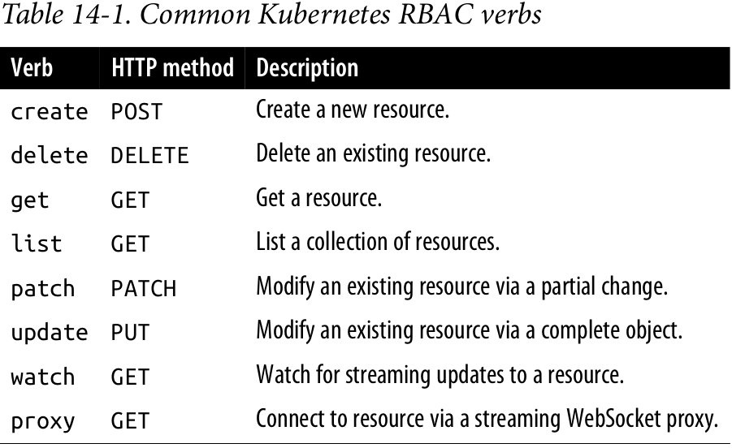

# Role-Based Access Control for Kubernetes

At this point, nearly every Kubernetes cluster you encounter has role-based access control (RBAC) enabled. So you likely have at least partially encountered RBAC before. Perhaps you initially couldn’t access your cluster until you used some magical incantation to add a RoleBinding to map a user to a role. However, even though you may have had some exposure to RBAC, you may not have had a great deal of experi‐ ence understanding RBAC in Kubernetes, what it is for, and how to use it successfully.

RBAC was introduced into Kubernetes with version 1.5 and became generally avail‐ able in Kubernetes 1.8. Role-based access control provides a mechanism for restrict‐ ing both access to and actions on Kubernetes APIs to ensure that only appropriate users have access to APIs in the cluster. RBAC is a critical component to both harden access to the Kubernetes cluster where you are deploying your application and (possi‐ bly more importantly) prevent unexpected accidents where one person in the wrong namespace mistakenly takes down production when they think they are destroying their test cluster.

Before we dive into the details of RBAC in Kubernetes, it’s valuable to have a high- level understanding of RBAC as a concept, as well as 
authentication and authoriza‐ tion more generally.

Every request to Kubernetes is first a authenticated. Authentication provides the iden‐ tity of the caller issuing the request. It could be as simple as saying that the request is unauthenticated, or it could integrate deeply with a pluggable authentication provider (e.g., Azure Active Directory) to establish an identity within that third-party system.

Once users have been properly identified, the authorization phase determines whether they are authorized to perform the request. Authorization is a combination of the identity of the user, the resource (effectively the HTTP path), and the verb or action the user is attempting to perform. If the particular user is authorized for per‐ forming that action on that resource, then the request is allowed to proceed. Other‐ wise, an HTTP 403 error is returned.

## Role-Based Access Control

To properly manage access in Kubernetes, it’s critical to understand how identity, roles, and role bindings interact to control who can do what with what resources.

### Identity in Kubernetes

Every request that comes to Kubernetes is associated with some identity. Even a request with no identity is associated with the `system:unauthenticated` group. Kubernetes makes a distinction between user identities and service account identities. Service accounts are created and managed by Kubernetes itself and are generally asso‐ ciated with components running inside the cluster. User accounts  are all other accounts associated with actual users of the cluster, and often include automation like continuous delivery as a service that runs outside of the cluster.

Kubernetes uses a generic interface for authentication providers. Each of the provid‐ ers supplies a username and optionally the set of groups to which the user belongs.

Kubernetes supports a number of different authentication providers, including:
- HTTP Basic Authentication (largely deprecated)
- x509 client certificates
- Static token files on the host
- Cloud authentication providers like Azure Active Directory and AWS Identity
and Access Management (IAM)
- Authentication webhooks

### Understanding Roles and Role Bindings

Identity is just the beginning of authorization in Kubernetes. Once the system knows the identity of the request, it needs to determine if the request is authorized for that user. To achieve this, it uses the general concept of roles and role bindings.

A _role_ is a set of abstract capabilities. For example, the `appdev` role might represent the ability to create Pods and services. A role binding is an assignment of a role to one or more identities. Thus, binding the `appdev` role to the user identity `alice` indicates that Alice has the ability to create Pods and services.

### Roles and Role Bindings in Kubernetes

In Kubernetes there are two pairs of related resources that represent roles and role bindings. One pair applies to just a namespace (`Role` and `RoleBinding`) while the other pair applies across the cluster (`ClusterRole` and `ClusterRoleBinding`).

`Role` resources are namespaced, and repre‐ sent capabilities within that single namespace. You cannot use namespaced roles for non-namespaced resources (e.g., CustomResourceDefinitions), and binding a `RoleBinding` to a role only provides  authorization within the Kubernetes namespace that contains both the `Role` and the `RoleDefinition`.

The [simple-role.yaml](examples/simple-role.yaml) provides a YAML definition of a `Role`.

The [simple-role-binding.yaml](examples/simple-role-binding.yaml) shows how to bind the role to the user `alice` and the group `mydevs`.

Of course, sometimes you want to create a role that applies to the entire cluster, or you want to limit access to cluster-level resources. To achieve this, you use the `ClusterRole` and `ClusterRoleBinding` resources. resources. They are largely identical to their namespaced peers, but with larger scope.

#### Verbs for Kubernetes roles

The commonly used verbs in Kubernetes RBAC are listed in the following table:



#### Using built-in roles

Of course, designing your own roles can be complicated and time-consuming. Fur‐ thermore, Kubernetes has a large number of well-known system identities (e.g., a scheduler) that require a known set of capabilities. Consequently, Kubernetes has a large number of built-in cluster roles.

```bash
kubectl get clusterroles
```

While most of these built-in roles are for system utilities, four are designed for
generic end users:

- The `cluster-admin` role provides complete access to the entire cluster.
- The `admin` role provides complete access to a complete namespace.
- The `edit` role allows an end user to modify things in a namespace.
- The `view` role allows for read-only access to a namespace.

Most clusters already have numerous `ClusterRole` bindings set up, and you can view these bindings with `kubectl get clusterrolebindings`.

#### Auto-reconciliation of built-in roles

When the Kubernetes API server starts up, it automatically installs a number of default  ClusterRoles that are defined in the code of the API server itself.  This means that if you modify any built-in cluster role, those modifications are transient. Whenever the API server is restarted (e.g., for an upgrade) your changes will be overwritten.

To prevent this from happening, before you make any other modifications you need to add the `rbac.authorization.kubernetes.io/autoupdate` annotation with a value of  `false` to the built-in ClusterRole resource. If this annotation is set to `false`, the API server will not overwrite the modified `ClusterRole` resource.

## Techniques for Managing RBAC

Managing RBAC for a cluster can be complicated and frustrating. Possibly more con‐ cerning is that misconfigured RBAC can lead to security issues. Fortunately, there are several tools and techniques that make managing RBAC easier.

### Testing Authorization with can-i

This tool is very useful for testing if a particular user can do a particular action.

For example, this command will indicate if the current `kubectl` user is authorized to create Pods:

```bash
kubectl auth can-i create pods
```

You can also test subresources like logs or port forwaeding with the `--subresource` command-line flag:

```bash
kubectl auth can-i get pods --subresource=logs
```

### Managing RBAC in Source Control

Like all resources in Kubernetes, RBAC resources are modeled using JSON or YAML. Given this text-based representation it makes sense to store these resources in version control. Indeed, the strong need for audit, accountability, and rollback for changes to RBAC policy means that version control for RBAC resources is essential.

The `reconcile` command operates somewhat like `apply` and will reconcile a text-based set of roles and role bindings with the current state of the cluster.

```bash
kubectl auth reconcile -f some-rbac-config.yaml
```

## Advanced Topics
Once you orient to the basics of role-based access control it is relatively easy to man‐ age access to a Kubernetes cluster, but when managing a large number of users or roles, there are additional advanced capabilities you can use to manage RBAC at scale.

### Aggregating ClusterRoles

Sometimes you want to be able to define roles that are combinations of other roles. One option would be to simply clone all of the rules from one ClusterRole `ClusterRole` into another `ClusterRole`, but this is complicated and error-prone, since changes to one `ClusterRole` aren’t automatically reflected in the other. Instead, Kubernetes RBAC supports the usage of an aggregation rule to combine multiple roles together in a new role. This new role combines all of the capabilities of all of the aggregate roles together, and any changes to any of the constituent subroles will automatically be propagated back into the aggregate role.

Like with all other aggregations or groupings in Kubernetes, the ClusterRoles to be aggregated are specified using label selectors.

A best practice for managing `ClusterRole` resources is to create a number of fine- grained cluster roles and then aggregate them together to form higher-level or broadly defined cluster roles. For example, you can see that the built-in `edit` role looks like this.

```yaml
apiVersion: rbac.authorization.k8s.io/v1
kind: ClusterRole
metadata:
name: edit
    ...
aggregationRule:
    clusterRoleSelectors:
    - matchLabels:
        rbac.authorization.k8s.io/aggregate-to-edit: "true"
...
```

### Using Groups for Bindings

When managing a large number of people in different organizations with similar access to the cluster, it’s generally a best practice to use groups to manage the roles that define access to the cluster, rather than individually adding bindings to specific identities.

There are several reasons why using groups is a preferred strategy for managing access at scale. The first is that in any large organization, access to the cluster is defined in terms of the team that someone is part of, rather than their specific iden‐ tity.

Additional benefits of binding roles to groups instead of individuals are simplicity and consistency. When someone joins or leaves a team, it is straightforward to simply add or remove them to or from a group in a single operation.

Furthermore, many group systems enable “just in time” (JIT) access such that people are only temporarily added to a group in response to an event (say, a page in the mid‐ dle of the night) rather than having standing access.

Finally, in many cases these same groups are used to manage access to other resour‐ ces, from facilities to documents and machine logins. Thus, using the same groups for access control to Kubernetes dramatically simplifies management.

## Summary
When you begin with a small cluster and a small team, it is sufficient to have every member of the team have equivalent access to the cluster. But as teams grow and products become more mission critical, limiting access to parts of the cluster is cru‐ cial. In a well-designed cluster, access is limited to the minimal set of people and capabilities needed to efficiently manage the applications in the cluster. Understand‐ ing how Kubernetes implements RBAC and how those capabilities can be used to control access to your cluster is important for both developers and cluster adminis‐ trators. As with building out testing infrastructure, best practice is to set up proper RBAC earlier rather than later. It’s far easier to start with the right foundation than to try to retrofit it later on. Hopefully, the information in this chapter has provided the necessary grounding for adding RBAC to your cluster.
