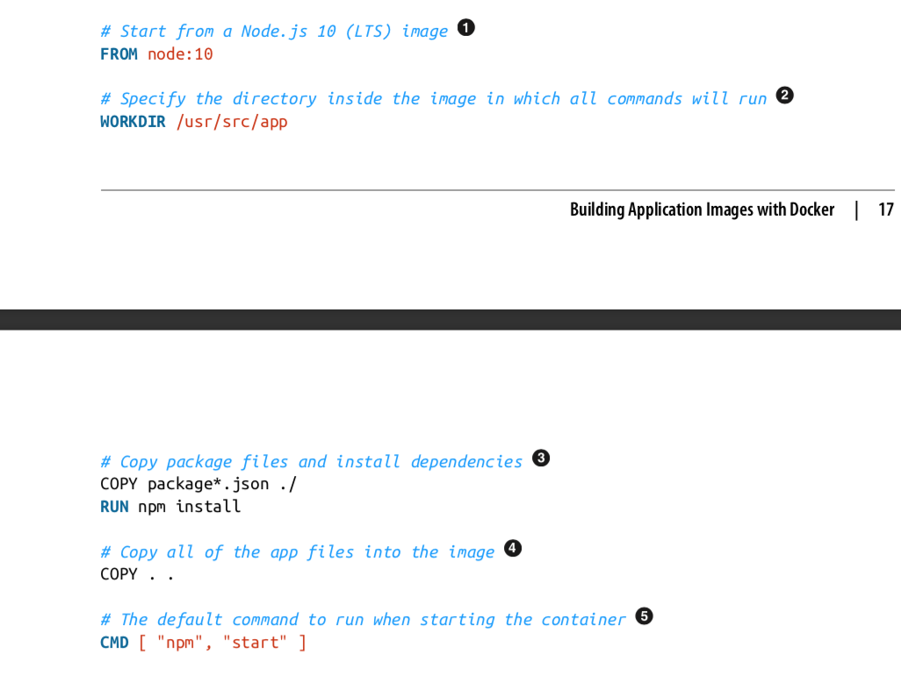
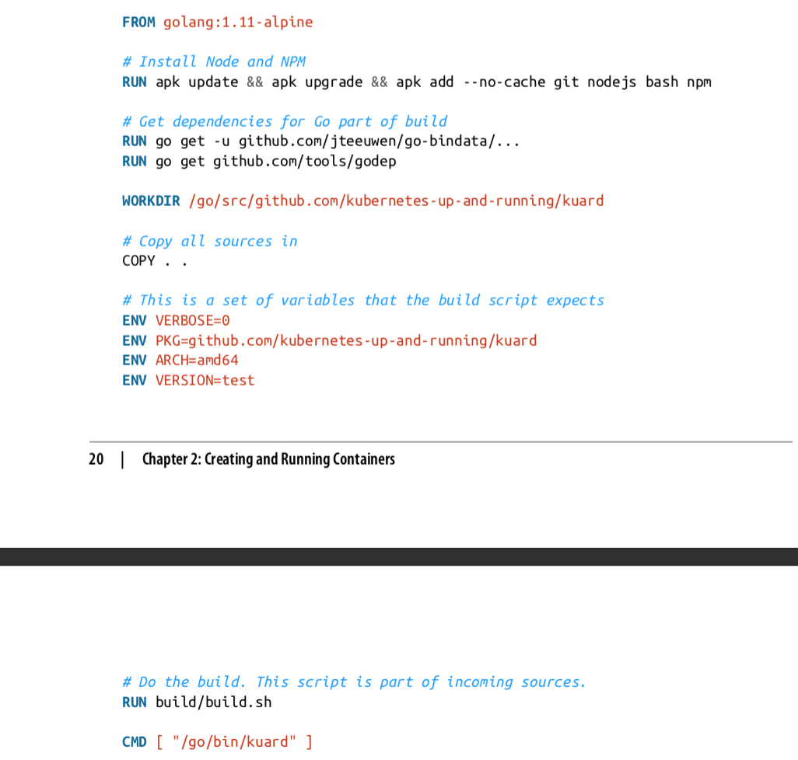
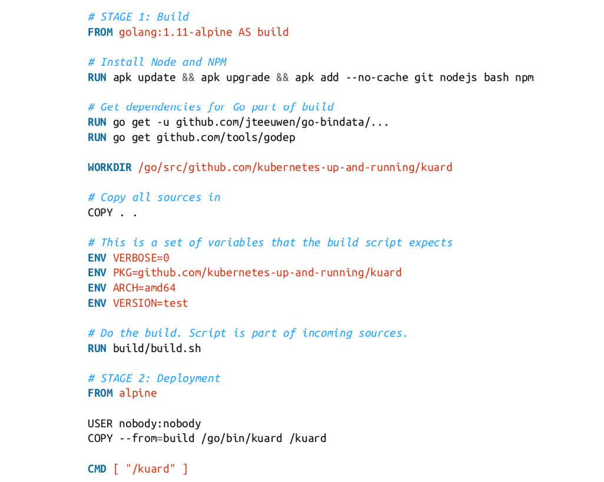

# Creating and Running Containers
* Applications ultimately are all comprised of one or more programs that run on individual machines.
* Applications are comprosed of a language runtime, libraries, and your source code. This dependency on shared libraries causes problems when an application developed on a programmer's laptop has a dependency on a shared library that isn't available when the program is rolled out to the production OS.
* A program can only execute successfully if it can be reliably deployed onto the machine it should run.
* When working with applications it's often helpful to package them in a way that makes it easy to share them with others. Docker, the default container runtime engine, makes it easty to package an executable and push it to a remote registry where it can later be pulled by others.
* Container images bundle a program and its dependencies into a single artifcat under a root filesystem.
## Container Images
* A _container image_ is a binary package that encapsulates all of the files necessary to run a program inside of an OS container. Depending on how your first experiment with containers, you will either build a container image from your local filesystem or download a preexisting image from a _container registry_.
* Container images are typically combined with a container configuration file, which provides instructions on how to set up the container environment and execute an application entry point.
* Containers fall into two main categories:
    * System containers
    * Application containers
* System containers seek to mimic virtual machines and often run a full boot process
* Application containers differ from system containers in that they commonly run a single program.
### The Docker Image Format
* The most popular image format is the Docker format, that is ran using the `docker` command.
* Docker images are made up of a series of filesystem layers.
* Each layer adds, removes, or modifies files from the preceding layer in the filesystem.
#### Container Layering
* Container images are constructed with a series of filesystem layers, where each layer inherits and modifies the layers that came before it.
* Conceptually, each container image layer builds upon a previous one. Each parent reference is a pointer.
## Building Application Images with Docker
### Dockerfiles
* A Dockerfile can be used to automate the creation of a Docker container image.

### Optimizing Image Sizes
* There are several gotchas that come when people begin to experiment with container images that lead to overly large images. The first thing to remember is that files that are removed by subsequent layers in the system are actually still present in the images; they're just inaccessible.
* For instance:
    * Layer A: contains a large file named 'BigFile'
        * Layer B: removes 'BigFile'
            * Layer C: builds on B by adding a static binary
    * _BigFile_ is still transmitted through the network, even if you can no longer access it.
* Every time you change a layer, it changes every layer that comes after it.
* However, consider that hapens when server.js changes. In one case, it is only the change that needs to tbe pulled or pushed, but in the other case, both _server.js_ and the layer providing the `node` package need to be pulled and pushed, since the `node` layer is dependent on the _server.js_ layer.
* In general, yo want to order your layers from least likely to change to most likely to change in order to optimize the image size for pushing and pulling.
### Image Security
* Do not build containers with passwords baked in - and this includes not just in the final layer, but any layers in the image. One of the counterintuitive problems introduced by container layers is that deleting a file in one layer does not delete that file from preceding layers.
* Secrets and images should _never_ be mixed.
## Multistage Image Builds
* One of the most common ways to accidentally build large images is to do the actual program compilation as pasrt of the construction of the application container image.
* The trouble with doing this is that it leaves all of the unnecessary development tools, which are usually quite large, lying around inside of your image and slowing down your deployments.
* To resolve this problem, Docker introduced _multistage builds_.

* In the image above, Go development tools and the tools to build the React.js frontend and the source code for the application are not needed by the final application.
* With _multistage builds_, only the necessary is added to the final image, as shown below:

## Storing Images in a Remote Registry
* What good is a container image if it's only available on a single machine?
* The standard within the Docker community is to store Docker images in a remote registry.
* There are private and public registries.
* The most popular is the Docker Hub image registry.
## The Docker Container Runtime
* Kubernetes provides an API for describing an application deployment, but relies on a container runtime to set up an application contianer using the container-specific APIs native to the target OS.
### Running Containers with Docker
* The Docker CLI tool can be used to deploy containers: `docker run -d --name kuard --publish 8080:8080 gcr.io/kuar-demo/kuard-amd64:blue`
### Exploring he kuard Application
* `curl http://localhost:8080`
### Limiting Resource Usage
* This allows multiple applications to coexist on the same hardware and ensures fair usage.
#### Limiting memory resources
* `docker run -d --name kuard --publish 8080:8080 --memory 200m --memory-swap 1G --cpu-shares 1024 gcr.io/kuar-demo/kuard-amd64:blue`
* `--memory 200m`: limits kuard to 200 MB
* `--memory-swap 1G`: limits kuard to 1 GB of swap space
* `--cpu-shares 1024`: limites the CPU utilization
#### Cleanup
* Once you are done building an image, you can delete it with the `docker rmi command.
* Unless you explicitly delete an image it will live on your system forever, _even_ if you build a new image with an identical name. Building this new image simply moves the tag to the new image, it does not delete or replace the old image.
* To see the images currently on your machine, you can use the `docker images` command. You can then delete tags you are no longer using.