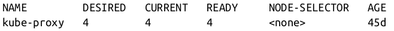

# Deploying a Kubernetes Cluster

Now that you have successfully built an application container, the next step is to learn how to transform it into a complete, reliable, scalable distributed system. To do that, you need a working Kubernetes cluster.

Of course, using a cloud-based solution requires paying for those cloud-based resources as well as having an active network connection to the cloud. For these reasons, local development can be more attractive, and in that case the `minikube` tool provides an easy-to-use way to get a local Kubernetes cluster up running in a VM on your local laptop or desktop.

For that reason, we recommend people start with a cloud-based solution, unless it really doesn’t work for their situation. A more recent alternative is to run a Docker-in-Docker cluster, which can spin up a multi-node cluster on a single machine. This project is still in beta, though, so keep in mind that you may encounter unexpected issues.

## Installing Kubernetes on a Public Cloud Provider

This chapter covers installing Kubernetes on the three major cloud providers: Amazon Web Services, Microsoft Azure, and the Google Cloud Platform.

### Google Kubernetes Engine

The Google Cloud Platform offers a hosted Kubernetes-as-a-Service called Google Kubernetes Engine (GKE). To get started with GKE, you need a Google Cloud Platform account with billing enabled and the gcloud tool installed.

Once you have gcloud installed, first set a default zone:

```bash
$ gcloud config set compute/zone us-west1-a
$ gcloud container clusters create kuar-cluster
$ gcloud auth application-default login
```

### Installing Kubernetes with Azure Kubernetes Service

Microsoft Azure offers a hosted Kubernetes-as-a-Service as part of the Azure Container Service. The easiest way to get started with Azure Container Service is to use the built-in Azure Cloud Shell in the Azure portal.

The shell has the az tool automatically installed and configured to work with your Azure environment. Alternatively, you can install the az command-line interface (CLI) on your local machine.

When you have the shell up and working, you can run:

```bash
$ az group create --name=kuar --location=westus
$ az aks create --resource-group=kuar --name=kuar-cluster
$ az aks get-credentials --resource-group=kuar --name=kuar-cluster
$ az aks install-cli
```

### Installing Kubernetes on Amazon Web Services

Amazon offers a managed Kubernetes service called Elastic Kubernetes Service (EKS). The easiest way to create an EKS cluster is via the open source eksctl command-line tool.

Once you have eksctl installed and in your path, you can run the following command to create a cluster:

```bash
$ eksctl create cluster --name kuar-cluster ...
$ eksctl create cluster --help
```

### Installing Kubernetes Locally Using minikube

If you need a local development experience, or you don’t want to pay for cloud resources, you can install a simple single-node cluster using minikube. Alternatively, if you have already installed Docker Desktop, it comes bundled with a single-machine installation of Kubernetes.

In addition, certain features described in this book require integration with a cloud provider. These features are either not available or work in a limited way with minikube.

You can find the minikube tool on GitHub. There are binaries for Linux, macOS, and Windows that you can download. Once you have the minikube tool installed, you can create a local cluster using:

```bash
$ minikube start
$ minikube stop
$ minikube delete
```

## Running Kubernetes in Docker

A different approach to running a Kubernetes cluster has been developed more recently, which uses Docker containers to simulate multiple Kubernetes nodes instead of running everything in a virtual machine. The kind project provides a great experience for launching and managing test clusters in Docker. (kind stands for Kubernetes IN Docker) kind is still a work in progress (pre 1.0), but is widely used by those building Kubernetes for fast and easy testing.

Installation instructions for your platform can be found at the kind site. Once you get it installed, creating a cluster is as easy as:

```bash
$ kind create cluster --wait 5m \
$ export KUBECONFIG="$(kind get kubeconfig-path)"
$ kubectl cluster-info
$ kind delete cluster
```

### The Kubernetes Client

The official Kubernetes client is kubectl : a command-line tool for interacting with the Kubernetes API. kubectl can be used to manage most Kubernetes objects, such as Pods, ReplicaSets, and Services. kubectl can also be used to explore and verify the overall health of the cluster.

#### Checking Cluster Status

The first thing you can do is check the version of the cluster that you are running:

```bash
$ kubectl version
```

First, you can get a simple diagnostic for the cluster. This is a good way to verify that your cluster is generally healthy:

```bash
$ kubectl get componentstatuses
```

The output should look like this:


You can see here the components that make up the Kubernetes cluster. The **controller-manager** is responsible for running various controllers that regulate behavior in the cluster; for example, ensuring that all of the replicas of a service are available and healthy. The **scheduler** is responsible for placing different Pods onto different nodes in the cluster. Finally, the **etcd** server is the storage for the cluster where all of the API objects are stored.

#### Listing Kubernetes Worker Nodes

Next, you can list out all of the nodes in your cluster:

```bash
$ kubectl get nodes
```


You can use the kubectl describe command to get more information about a specific node, such as node-1:

```bash
$ kubectl describe nodes node-1
```

First, you see basic information about the node:


Next, you see information about the operation of node-1 itself:


These statuses show that the node has sufficient disk and memory space and is reporting that it is healthy to the Kubernetes master. Next, there is information about the capacity of the machine:


Then there is information about the software on the node, including the version of Docker that is running, the versions of Kubernetes and the Linux kernel, and more:


Finally, there is information about the Pods that are currently running on this node:


### Cluster Components

One of the interesting aspects of Kubernetes is that many of the components that make up the Kubernetes cluster are actually deployed using Kubernetes itself. We’ll take a look at a few of these. These components use a number of the concepts that we’ll introduce in later chapters. All of these components run in the kube-system namespace.

#### Kubernetes Proxy

The Kubernetes proxy is responsible for routing network traffic to load-balanced services in the Kubernetes cluster. To do its job, the proxy must be present on every node in the cluster. Kubernetes has an API object named DaemonSet, which you will learn about later in the book, that is used in many clusters to accomplish this. If your cluster runs the Kubernetes proxy with a DaemonSet, you can see the proxies by running:

```bash
$ kubectl get daemonSets --namespace=kube-system kube-proxy
```



#### Kubernetes DNS

Kubernetes also runs a DNS server, which provides naming and discovery for the services that are defined in the cluster. This DNS server also runs as a replicated service on the cluster Depending on the size of your cluster, you may see one or more DNS servers running in your cluster. The DNS service is run as a Kubernetes deployment, which manages these replicas:

```bash
$ kubectl get deployments --namespace=kube-system core-dns
```

There is also a Kubernetes service that performs load balancing for the DNS server:

```bash
$ kubectl get services --namespace=kube-system core-dns
```

#### Kubernetes UI

The final Kubernetes component is a GUI. The UI is run as a single replica, but it is still managed by a Kubernetes deployment for reliability and upgrades. You can see this UI server using:

```bash
$ kubectl get deployments --namespace=kube-system kubernetes-dashboard
```

The dashboard also has a service that performs load balancing for the dashboard:

```bash
$ kubectl get services --namespace=kube-system kubernetes-dashboard
```

You can use kubectl proxy to access this UI. Launch the Kubernetes proxy using:

```bash
$ kubectl proxy
```

This starts up a server running on localhost:8001. If you visit http://localhost:8001/api/v1/namespaces/kubernetes-dashboard/services/https:kubernetes-dashboard:/proxy/ in your web browser, you should see the Kubernetes web UI

Some providers don’t install the Kubernetes dashboard by default, so don’t worry if you don’t see it in your cluster. Documentation on how to install the dashboard for these clusters is available at https://kubernetes.io/docs/tasks/access-application-cluster/web-ui-dashboard/.