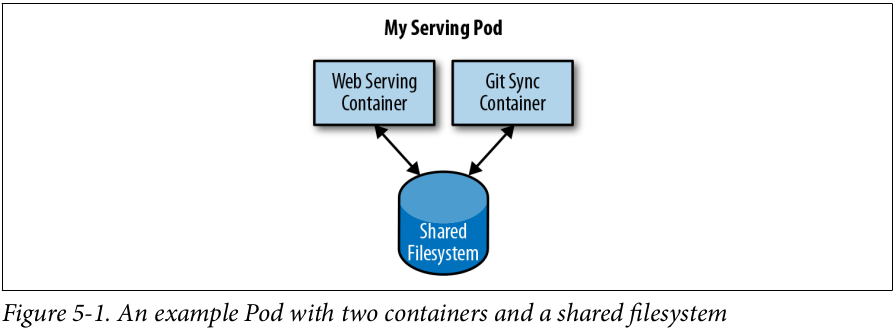

# Pods

In earlier chapters we discussed how you might go about containerizing your application, but in real-world deployments of containerized applications you will often want to colocate multiple applications into a single atomic unit, scheduled onto a single machine.



At first, it might seem tempting to wrap up both the web server and the Git synchronizer into a single container. After closer inspection, however, the reasons for the separation become clear. First, the two different containers have significantly different requirements in terms of resource usage. Take, for example, memory. Because the web server is serving user requests, we want to ensure that it is always available and responsive. On the other hand, the Git synchronizer isn’t really user-facing and has a “best effort” quality of service.

This sort of resource isolation is exactly the sort of thing that containers are designed to accomplish. By separating the two applications into two separate containers, we can ensure reliable web server operation.

Of course, the two containers are quite symbiotic; it makes no sense to schedule the web server on one machine and the Git synchronizer on another. Consequently, Kubernetes groups multiple containers into a single atomic unit called a _Pod_. (The name goes with the whale theme of Docker containers, since a Pod is also a group of whales.)

## Pods in Kubernetes

A Pod represents a collection of application containers and volumes running in the
same execution environment. Pods, not containers, are the smallest deployable arti‐
fact in a Kubernetes cluster. This means all of the containers in a Pod always land on
the same machine.

Containers in different Pods running on the same node might as well be on different servers.

## Thinking with Pods

Sometimes people see Pods and think, “Aha! A WordPress container and a MySQL database container should be in the same Pod.” However, this kind of Pod is actually an example of an anti-pattern for Pod construction.

If you group the WordPress and MySQL containers together in a single Pod, you are forced to use the same scaling strategy for both containers, which doesn’t fit well.

In general, the right question to ask yourself when designing Pods is, “Will these con‐
tainers work correctly if they land on different machines?” If the answer is "no", a Pod is the correct grouping for the containers. If the answer is "yes", multiple Pods is probably the correct solution.

## The Pod Manifest

Pods are described in a Pod manifest. The Pod manifest is just a text-file representation of the Kubernetes API object. Kubernetes strongly believes in _declarative configuration_. Declarative configuration means that you write down the desired state of the world in a configuration and then submit that configuration to a service that takes actions to ensure the desired state becomes the actual state.

The Kubernetes API server accepts and processes Pod manifests before storing them in persistent storage (`etcd`). The scheduler also uses the Kubernetes API to find Pods that haven’t been scheduled to a node. The scheduler then places the Pods onto nodes depending on the resources and other constraints expressed in the Pod manifests. Multiple Pods can be placed on the same machine as long as there are sufficient resources. However, scheduling multiple replicas of the same application onto the same machine is worse for reliability, since the machine is a single failure domain. Consequently, the Kubernetes scheduler tries to ensure that Pods from the same application are distributed onto different machines for reliability in the presence of such failures. Once scheduled to a node, Pods don’t move and must be explicitly destroyed and rescheduled.

## Creating a Pod
The simplest way to create a Pod is via the imperative `kubectl` run command. For
example, to run our same `kuard` server, use:

```bash
kubectl run --restart=Never --image=gcr.io/kuar-demo/kuard-amd64:blue kuard
```

You can see the status of this Pod by running:
```bash
kubectl get pods
```

For now, you can delete this Pod by running:
```bash
kubectl delete pods/kuard
```

We will now move on to writing a complete Pod manifest by hand.

## Creating a Pod Manifest
Pod manifests can be written using _YAML_ or _JSON_, but _YAML_ is generally preferred because it is slightly more human-editable and has the ability to add comments. Pod manifests (and other Kubernetes API objects) should really be treated in the same way as source code, and things like comments help explain the Pod to new team members who are looking at them for the first time.

Pod manifests include a couple of key fields and attributes: namely a _metadata_ section for describing the Pod and its labels, a _spec_ section for describing volumes, and a list of containers that will run in the Pod.

In Chapter 2 we deployed kuard using the following Docker command:
```bash
docker run -d --name kuard --publish 8080:8080 gcr.io/kuar-demo/kuard-amd64:blue
```

A similar result can be achieved by instead writing Example 5-1 to a file named [kuard-pod.yaml](examples/5-1-kuard-pod.yml) and then using _kubectl_ commands to load that manifest to Kubernetes.

## Running Pods
Use the _kubectl_ apply command to launch a single instance of kuard:
```bash
kubectl apply -f kuard-pod.yml
```

The Pod manifest will be submitted to the Kubernetes API server. The Kubernetes system will then schedule that Pod to run on a healthy node in the cluster, where it will be monitored by the _kubelet_ daemon process.

## Listing Pods
Using the _kubectl_ command-line tool, we can list all Pods running in the cluster. For now, this should only be the single Pod that we created in the previous step:

```bash
kubectl get pods
```
[](output-chapter-5-1.png)

If you ran this command immediately after the Pod was created, you might see:
[](output-chapter-5-2.png)

The Pending state indicates that the Pod has been submitted but hasn’t been scheduled yet.

## Pod Details
Sometimes, the single-line view is insufficient because it is too terse. Additionally, Kubernetes maintains numerous events about Pods that are present in the event stream, not attached to the Pod object.

To find out more information about a Pod (or any Kubernetes object) you can use the _kubectl_ describe command. For example, to describe the Pod we previously created, you can run:

```bash
kubectl describe pods kuard
```

This outputs a bunch of information about the Pod in different sections. At the top is
basic information about the Pod.

Then there is information about the containers running in the Pod.

Finally, there are events related to the Pod, such as when it was scheduled, when its
image was pulled, and if/when it had to be restarted because of failing health checks.

## Deleting a Pod
When it is time to delete a Pod, you can delete it either by name:
```bash
kubectl delete pods/kuard
```

or using the same file that you used to create it:
```bash
kubectl delete -f kuard-pod.yaml
```

When a Pod is deleted, it is not immediately killed. Instead, if you run `kubectl get pods` you will see that the Pod is in the `Terminating` state. All Pods have a termination grace period. By default, this is 30 seconds. When a Pod is transitioned to
`Terminating` it no longer receives new requests. In a serving scenario, the grace period is important for reliability because it allows the Pod to finish any active requests that it may be in the middle of processing before it is terminated.

It’s important to note that when you delete a Pod, any data stored in the containers associated with that Pod will be deleted as well. If you want to persist data across multiple instances of a Pod, you need to use `PersistentVolume`.

## Accessing Your Pod
Now that your Pod is running, you’re going to want to access it for a variety of reasons. You may want to load the web service that is running in the Pod. You may want to view its logs to debug a problem that you are seeing, or even execute other commands in the context of the Pod to help debug.

### Using Port Forwarding
Oftentimes you simply want to access a specific Pod, even if it’s not serving traffic on the internet. To achieve this, you can use the port-forwarding support built into the Kubernetes API and command-line tools.

```bash
kubectl port-forward kuard 8080:8080
```

A secure tunnel is created from your local machine, through the Kubernetes master, to the instance of the Pod running on one of the worker nodes.

### Getting More Info with Logs
When your application needs debugging, it’s helpful to be able to dig deeper than describe to understand what the application is doing. The _kubectl logs_ command downloads the current logs from the running instance:

```bash
kubectl logs kuard [-f] [--previous]
```

Adding the _-f_ flag will cause you to continuously stream logs.

The kubectl logs command always tries to get logs from the currently running container. Adding the _--previous_ flag will get logs from a previous instance of the container.

## Running Commands in Your Container with exec
Sometimes logs are insufficient, and to truly determine what’s going on you need to execute commands in the context of the container itself. To do this you can use:
```bash
kubectl exec kuard -- date
```

You can also get an interactive session by adding the -it flags:
```bash
kubectl exec -it kuard ash
```

## Copying Files to and from Containers
At times you may need to copy files from a remote container to a local machine for
more in-depth exploration.
```bash
kubectl cp <pod-name>:/captures/capture3.txt ./capture3.txt
```

Other times you may need to copy files from your local machine into a container.
```bash
kubectl cp $HOME/config.txt <pod-name>:/config.txt
```

Generally speaking, copying files into a container is an anti-pattern. You really should treat the contents of a container as immutable. But occasionally it’s the most immediate way to stop the bleeding and restore your service to health, since it is quicker than building, pushing, and rolling out a new image. Once the bleeding is stopped, however, it is critically important that you immediately go and do the image build and rollout, or you are guaranteed to forget the local change that you made to your container and overwrite it in the subsequent regularly scheduled rollout.

## Health Checks
When you run your application as a container in Kubernetes, it is automatically kept
alive for you using a _process health check_. This health check simply ensures that the main process of your application is always running. If it isn’t, Kubernetes restarts it.

However, in most cases, a simple process check is insufficient. For example, if your process has deadlocked and is unable to serve requests, a process health check will still believe that your application is healthy since its process is still running.

To address this, Kubernetes introduced health checks for application _liveness_.

### Liveness Probe
Once the kuard process is up and running, we need a way to confirm that it is actually healthy and shouldn’t be restarted. Liveness probes are defined per container, which means each container inside a Pod is health-checked separately. We can change our [kuard-pod.yml file](examples/5-2-kuard-pod-health.yml) to add a liveness probe tgo our _kuard_ container.

The preceding Pod manifest uses an httpGet probe to perform an HTTP GET request against the _/healthy_ endpoint on port 8080 of the kuard container. The probe sets an _initialDelaySeconds_ of 5 , and thus will not be called until 5 seconds after all the containers in the Pod are created. The probe must respond within the 1-second time‐out, and the HTTP status code must be equal to or greater than 200 and less than 400 to be considered successful. Kubernetes will call the probe every 10 seconds. If more than three consecutive probes fail, the container will fail and restart.

### Readiness Probe
Kubernetes makes a distinction between _liveness_ and _readiness_. Liveness determines if an application is running properly. Containers that fail liveness checks are restarted. Readiness describes when a container is ready to serve user requests. Containers that fail readiness checks are removed from service load balancers. Readiness probes are configured similarly to liveness probes.

### Types of Health Checks
In addition to HTTP checks, Kubernetes also supports _tcpSocket_ health checks that open a TCP socket; if the connection is successful, the probe succeeds. This style of
probe is useful for non-HTTP applications; for example, databases or other non-HTTP-based APIs.

Finally, Kubernetes allows _exec probes_. These execute a script or program in the context of the container. Following typical convention, if this script returns a zero exit code, the probe succeeds; otherwise, it fails. _exec_ scripts are often useful for custom application validation logic that doesn’t fit neatly into an HTTP call.

## Resource Management
Most people move into containers and orchestrators like Kubernetes because of the radical improvements in image packaging and reliable deployment they provide. In addition to application-oriented primitives that simplify distributed system development, equally important is the ability to increase the overall utilization of the compute nodes that make up the cluster. The basic cost of operating a machine, either virtual or physical, is basically constant regardless of whether it is idle or fully loaded. Consequently, ensuring that these machines are maximally active increases the efficiency of every dollar spent on infrastructure.

Generally speaking, we measure this efficiency with the _utilization metric_. Utilization is defined as the amount of a resource actively being used divided by the amount of a resource that has been purchased.

Kubernetes allows users to specify two different resource metrics. Resource _requests_ specify the minimum amount of a resource required to run the application. Resource _limits_ specify the maximum amount of a resource that an application can consume.

### Resource Requests: Minimum Required Resources
A Pod requests the resources required to run its containers. The most commonly requested resources are CPU and memory, but Kubernetes has support for other
resource types as well, such as GPUs and more.

For example, to request that the kuard container lands on a machine with half a CPU free and gets 128 MB of memory allocated to it, we change our [kuard-pod.yml file](5-3-kuard-pod-resreq.yml) again.

#### Request limit details
Requests are used when scheduling Pods to nodes. The Kubernetes scheduler will ensure that the sum of all requests of all Pods on a node does not exceed the capacity of the node. Therefore, a Pod is guaranteed to have at least the requested resources when running on the node. Importantly, “request” specifies a minimum. It does not specify a maximum cap on the resources a Pod may use. To explore what this means,let’s look at an example.

Imagine that we have container whose code attempts to use all available CPU cores. Suppose that we create a Pod with this container that requests 0.5 CPU. Kubernetes schedules this Pod onto a machine with a total of 2 CPU cores. As long as it is the only Pod on the machine, it will consume all 2.0 of the available cores, despite only requesting 0.5 CPU.

If a second Pod with the same container and the same request of 0.5 CPU lands on the machine, then each Pod will receive 1.0 cores.

If a third identical Pod is scheduled, each Pod will receive 0.66 cores. Finally, if a fourth identical Pod is scheduled, each Pod will receive the 0.5 core it requested, and the node will be at capacity.

Since resource requests guarantee resource availability to a Pod, they are critical to ensuring that containers have sufficient resources in high-load situations.

### Capping Resource Usage with Limits
In addition to setting the resources required by a Pod, which establishes the minimum resources available to the Pod, you can also set a maximum on a Pod’s resource usage via resource _limits_.

We can extend the configuration in [kuard-pod.yml file](5-4-kuard-pod-reslim.yml) to add a limit of 1.0 CPU and 256 MB of memory.

When you establish limits on a container, the kernel is configured to ensure that consumption cannot exceed these limits. A container with a CPU limit of 0.5 cores will only ever get 0.5 cores, even if the CPU is otherwise idle.

## Persisting Data with Volumes
When a Pod is deleted or a container restarts, any and all data in the container’s filesystem is also deleted. This is often a good thing, since you don’t want to leave around cruft that happened to be written by your stateless web application. In other cases, having access to persistent disk storage is an important part of a healthy application. Kubernetes models such persistent storage.

### Using Volumes with Pods
To add a volume to a Pod manifest, there are two new stanzas to add to our configuration. The first is a new _spec.volumes_ section. This array defines all of the volumes that may be accessed by containers in the Pod manifest. It’s important to note that not all containers are required to mount all volumes defined in the Pod. The second addition is the _volumeMounts_ array in the container definition. This array defines the volumes that are mounted into a particular container, and the path where each volume should be mounted. Note that two different containers in a Pod can mount the same volume at different mount paths.

We can update our [kuard-pod.yml file](examples/5-5-kuard-pod-vol.yml) again.

#### Different Ways of Using Volumes with Pods
There are a variety of ways you can use data in your application. The following are a few, and the recommended patterns for Kubernetes.

* Communication/synchronization
In the first example of a Pod, we saw how two containers used a shared volume to serve a site while keeping it synchronized to a remote Git location. To achieve this, the Pod uses an _emptyDir_ volume. Such a volume is scoped to the Pod’s lifespan, but it can be shared between two containers, forming the basis for communication between our Git sync and web serving containers.

* Cache
An application may use a volume that is valuable for performance, but not required for correct operation of the application. For example, perhaps the application keeps prerendered thumbnails of larger images. Of course, they can be reconstructed from the original images, but that makes serving the thumbnails more expensive. You want such a cache to survive a container restart due to a health-check failure, and thus _emptyDir_ works well for the cache use case as well.

* Persistent data
Sometimes you will use a volume for truly persistent data—data that is independent
of the lifespan of a particular Pod, and should move between nodes in the cluster if a
node fails or a Pod moves to a different machine for some reason. To achieve this,
Kubernetes supports a wide variety of remote network storage volumes, including
widely supported protocols like NFS and iSCSI as well as cloud provider network
storage like Amazon’s Elastic Block Store, Azure’s Files and Disk Storage, as well as
Google’s Persistent Disk.

* Mounting the host filesystem
Other applications don’t actually need a persistent volume, but they do need some
access to the underlying host filesystem. For example, they may need access to
the _/dev_ filesystem in order to perform raw block-level access to a device on the sys‐
tem. For these cases, Kubernetes supports the _hostPath_ volume, which can mount
arbitrary locations on the worker node into the container.

#### Persisting Data Using Remote Disks
Oftentimes, you want the data a Pod is using to stay with the Pod, even if it is restarted on a different host machine.

To achieve this, you can mount a remote network storage volume into your Pod. When using network-based storage, Kubernetes automatically mounts and unmounts the appropriate storage whenever a Pod using that volume is scheduled onto a particular machine.

## Putting It All Together
Many applications are stateful, and as such we must preserve any data and ensure access to the underlying storage volume regardless of what machine the application runs on.

Through a combination of persistent volumes, readiness and liveness probes, and resource restrictions, Kubernetes provides everything needed to run stateful applications reliably. The final [kuard-pod.yml](examples/5-6-kuard-pod-full.yml) pulls this all together into one manifest.

## Summary
Pods represent the atomic unit of work in a Kubernetes cluster. Pods are comprised of one or more containers working together symbiotically. To create a Pod, you write a Pod manifest and submit it to the Kubernetes API server by using the command-line tool or (less frequently) by making HTTP and JSON calls to the server directly.

Once you’ve submitted the manifest to the API server, the Kubernetes scheduler finds a machine where the Pod can fit and schedules the Pod to that machine. Once scheduled, the _kubelet_ daemon on that machine is responsible for creating the containers that correspond to the Pod, as well as performing any health checks defined in the Pod manifest.

Once a Pod is scheduled to a node, no rescheduling occurs if that node fails. Additionally, to create multiple replicas of the same Pod you have to create and name them manually. In a later chapter we introduce the ReplicaSet object and show how you can automate the creation of multiple identical Pods and ensure that they are recreated in the event of a node machine failure.
