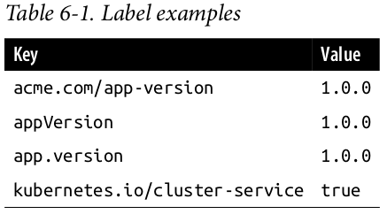
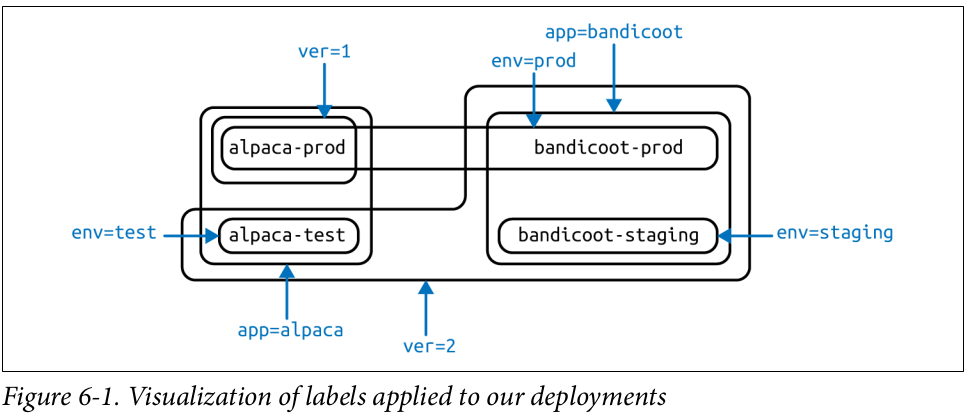
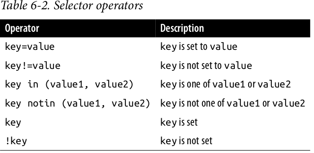

# Labels And Annotations
Kubernetes was made to grow with you as your application scales in both size and complexity. With this in mind, labels and annotations were added as foundational concepts.

_Labels_ are key/value pairs that can be attached to Kubernetes objects such as Pods and ReplicaSets. They can be arbitrary, and are useful for attaching identifying information to Kubernetes objects. Labels provide the foundation for grouping objects.

_Annotations_, on the other hand, provide a storage mechanism that resembles labels: annotations are key/value pairs designed to hold non-identifying information that can be leveraged by tools and libraries.

## Labels
Labels provide identifying metadata for objects. These are fundamental qualities of the object that will be used for grouping, viewing, and operating.

Labels have simple syntax. They are key/value pairs, where both the key and value are represented by strings. Label keys can be broken down into two parts: an optional prefix and a name, separated by a slash. The prefix, if specified, must be a DNS sub‐ domain with a 253-character limit. The key name is required and must be shorter than 63 characters. Names must also start and end with an alphanumeric character and permit the use of dashes (-), underscores (_), and dots (.), between characters.

Label values are strings with a maximum length of 63 characters. The contents of the label values follow the same rules as for label keys.



For example, a project might define a canonical set of labels used to identify the various stages of application deployment (e.g., staging, canary, production).

### Applying Labels
Here we create a few deployments (a way to create an array of Pods) with some interesting labels. We’ll take two apps (called alpaca and bandicoot ) and have two environments for each. We will also have two different versions:

```bash
kubectl run alpaca-prod --image=gcr.io/kuar-demo/kuard-amd64:blue --labels="ver=1,app=alpaca,env=prod"
kubectl run alpaca-test --image=gcr.io/kuar-demo/kuard-amd64:green --labels="ver=2,app=alpaca,env=test"
kubectl run bandicoot-prod --image=gcr.io/kuar-demo/kuard-amd64:green --labels="ver=2,app=bandicoot,env=prod"
kubectl run bandicoot-staging --image=gcr.io/kuar-demo/kuard-amd64:green --labels="ver=2,app=bandicoot,env=staging"
```

At this point you should have four deployments - _alpaca-prod_, _alpaca-test_, _bandicoot-prod_, and _bandicoot-staging_:
```bash
kubectl get pods --show-labels
```

We can visualize this as a Venn diagram based on the labels.


## Modifying Labels
Labels can also be applied (or updated) on objects after they are created:
```bash
kubectl label deployments alpaca-test "canary=true"
```

You can remove a label by applying a dash suffix:
```bash
kubectl label deployments alpaca-test "canary-"
```

## Label Selectors
Label selectors are used to filter Kubernetes objects based on a set of labels. Selectors use a simple Boolean language. They are used both by end users (via tools like _kubectl_) and by different types of objects (such as how a ReplicaSet relates to its Pods).

If we only wanted to list Pods that had the ver label set to 2 , we could use the
--selector flag:
```bash
kubectl get pods --selector="ver=2"
```

If we specify two selectors separated by a comma, only the objects that satisfy both
will be returned. This is a logical AND operation:
```bash
kubectl get pods --selector="app=bandicoot,ver=2"
```

We can also ask if a label is one of a set of values. Here we ask for all Pods where the app label is set to alpaca or bandicoot (which will be all the Pods):
```bash
kubectl get pods --selector="app in (alpaca,bandicoot)"
```

Finally, we can ask if a label is set at all. Here we are asking for all of the deployments with the _canary_ label set to anything:
```bash
kubectl get deployments --selector="canary"
```


### Labels in the Kubernetes Architecture
In addition to enabling users to organize their infrastructure, labels play a critical role in linking various related Kubernetes objects.  Kubernetes is a purposefully decoupled system. There is no hierarchy and all components operate independently. However, in many cases objects need to relate to one another, and these relationships are defined by labels and label selectors.

For example, ReplicaSets, which create and maintain multiple replicas of a Pod, find the Pods that they are managing via a selector. Likewise, a service load balancer finds the Pods it should bring traffic to via a selector query. When a Pod is created, it can use a node selector to identify a particular set of nodes that it can be scheduled onto.

Labels are a powerful and ubiquitous glue that holds a Kubernetes application together. Though your application will likely start out with a simple set of labels and queries, you should expect it to grow in size and sophistication with time.

## Annotations
Annotations provide a place to store additional metadata for Kubernetes objects with the sole purpose of assisting tools and libraries. They are a way for other programs driving Kubernetes via an API to store some opaque data with an object.

While labels are used to identify and group objects, annotations are used to provide extra information about where an object came from, how to use it, or policy around that object. There is overlap, and it is a matter of taste as to when to use an annotation or a label. When in doubt, add information to an object as an annotation and promote it to a label if you find yourself wanting to use it in a selector.

Annotations are used to:
* Keep track of a “reason” for the latest update to an object.
* Communicate a specialized scheduling policy to a specialized scheduler.
* Extend data about the last tool to update the resource and how it was updated (used for detecting changes by other tools and doing a smart merge).
* Attach build, release, or image information that isn’t appropriate for labels (may include a Git hash, timestamp, PR number, etc.).
* Enable the Deployment object (Chapter 10) to keep track of ReplicaSets that it is managing for rollouts.
* Provide extra data to enhance the visual quality or usability of a UI. For example, objects could include a link to an icon (or a base64-encoded version of an icon).
* Prototype alpha functionality in Kubernetes (instead of creating a first-class API field, the parameters for that functionality are encoded in an annotation).

Annotations are used in various places in Kubernetes, with the primary use case being rolling deployments. During rolling deployments, annotations are used to track rollout status and provide the necessary information required to roll back a deployment to a previous state.

Annotations are good for small bits of data that are highly associated with a specific resource. If you want to store data in Kubernetes but you don’t have an obvious object to associate it with, consider storing that data in some other, more appropriate database.

### Defining Annotations
Annotation keys use the same format as label keys. However, because they are often used to communicate information between tools, the “namespace” part of the key is more important. Example keys include _deployment.kubernetes.io/revision_ or _kubernetes.io/change-cause_.

The value component of an annotation is a free-form string field. While this allows maximum flexibility as users can store arbitrary data, because this is arbitrary text, there is no validation of any format.

## Summary
Labels are used to identify and optionally group objects in a Kubernetes cluster. Labels are also used in selector queries to provide flexible runtime grouping of objects such as Pods.

Annotations provide object-scoped key/value storage of metadata that can be used by automation tooling and client libraries. Annotations can also be used to hold configuration data for external tools such as third-party schedulers and monitoring tools.

Labels and annotations are vital to understanding how key components in a Kubernetes cluster work together to ensure the desired cluster state. Using labels and annotations properly unlocks the true power of Kubernetes’s flexibility and provides the starting point for building automation tools and deployment workflows.