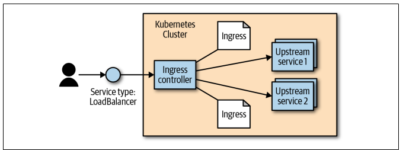

# HTTP Load Balancing with Ingress
A critical part of any application is getting network traffic to and from that application. As described in Chapter 7, Kubernetes has a set of capabilities to enable services to be exposed outside of the cluster. For many users and simple use cases these capabilities are sufficient.

Ingress exposes HTTP and HTTPS routes from outside the cluster to services within the cluster. Traffic routing is controlled by rules defined on the Ingress resource.

Here is a simple example where an Ingress sends all its traffic to one Service. The Ingress controller is a software system exposed outside the cluster using a service of type: LoadBalancer. It then proxies requests to “upstream” servers. The configuration for how it does this is the result of reading and monitoring Ingress objects.



## Set up Ingress on Minikube with the NGINX Ingress Controller
An Ingress is an API object that defines rules which allow external access to services in a cluster. An Ingress controller fulfills the rules set in the Ingress.

Locally
If you already installed Minikube locally, run minikube start to create a cluster.

### Enable the Ingress controller

1) To enable the NGINX Ingress controller, run the following command:

```bash
minikube addons enable ingress
```

2) Verify that the NGINX Ingress controller is running

```bash
kubectl get pods -n ingress-nginx
```

### Deploy a hello, world app

1) Create a Deployment using the following command:

```bash
kubectl create deployment web --image=gcr.io/google-samples/hello-app:1.0
```

2) Expose the Deployment:

```bash
kubectl expose deployment web --type=NodePort --port=8080
```

3) Verify the Service is created and is available on a node port:

```bash
kubectl get service web
```

4) Visit the Service via NodePort:

```bash
minikube service web --url
```

## Create an Ingress

The following manifest defines an Ingress that sends traffic to your Service via hello-world.info.

1) Create example-ingress.yaml from the following file:

```bash
apiVersion: networking.k8s.io/v1
kind: Ingress
metadata:
  name: example-ingress
  annotations:
    nginx.ingress.kubernetes.io/rewrite-target: /$1
spec:
  rules:
    - host: hello-world.info
      http:
        paths:
          - path: /
            pathType: Prefix
            backend:
              service:
                name: web
                port:
                  number: 8080
```

2) Create the Ingress object by running the following command:

```bash
kubectl apply -f example-ingress.yaml
```

3) Verify the IP address is set:

```bash
kubectl get ingress
```

4) Add the following line to the bottom of the /etc/hosts file on your computer (you will need adminstrator access):

```bash
172.17.0.15 hello-world.info
```

5) Verify that the Ingress controller is directing traffic:

```bash
curl hello-world.info
```

### Create a second Deployment

1) Create another Deployment using the following command:

```bash
kubectl create deployment web2 --image=gcr.io/google-samples/hello-app:2.0
```

2) Expose the second Deployment:

```bash
kubectl expose deployment web2 --port=8080 --type=NodePort
```

### Edit the existing Ingress

1) Edit the existing example-ingress.yaml manifest, and add the following lines at the end:

```bash
      - path: /v2
        pathType: Prefix
        backend:
          service:
            name: web2
            port:
              number: 8080
```

2) Apply the changes:

```bash
kubectl apply -f example-ingress.yaml
```

### Test your Ingress

1) Access the 1st version of the Hello World app.

```bash
curl hello-world.info
```

2) Access the 2nd version of the Hello World app.

```bash
curl hello-world.info/v2
```
